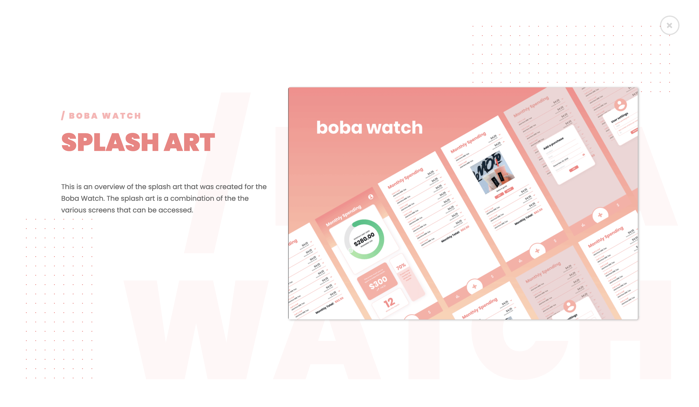
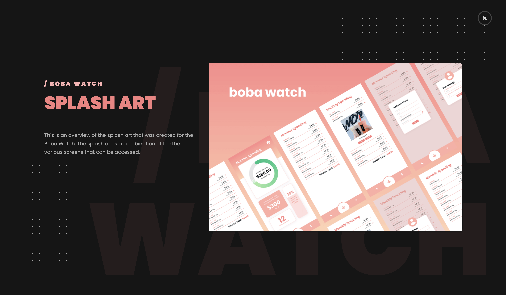

# @ryqndev/image-pane

A react component to display images when clicked.
## Usage 
```jsx
    <ImagePane
        className={cn.image}
        src='https://boba.watch/bobawatch.png'
        alt='boba watch various screens'
        content={{
            tag: '/ boba watch',
            title: 'splash art',
            description:
                'This is an overview of the splash art that was created for the Boba Watch. The splash art is a combination of the the various screens that can be accessed.',
        }}
    />
```



## Parameters
|Prop Name|Value|Example|Required|Description|
|---|---|---|---|---|
|className|string|`image-object`|No|Custom CSS class for regular image component that triggers image pane|
|contentClassName|string|`content-class`|No|Custom CSS class to style the pane. applied to the parent container only|
|src|string|https://boba.watch/bobawatch.png|Yes|link to image. uses html `` underneath and uses same src attribute|
|alt|string|view showing various screens from the app|No, but recommended for a11y|alternative text for image|
|content|object| <pre>{ <br />    tag: '/ boba watch',<br />    title: 'Splash Art',<br>    description: 'This is an <br /> overview of the splash art <br />that was created for the Boba <br/>Watch. The splash art is a <br />combination of the the various <br />screens that can be accessed.' <br/>}</pre> | No | content to be displayed on pane |

**note** The content json object does not have to be a string type. It can be a JSX component like so:
```js
    <ImagePane
        className={cn.image}
        src='https://boba.watch/bobawatch.png'
        alt='boba watch various screens'
        content={{
            tag: <>esta<wbr />blishment</>,
            title: 'splash art',
            description:
                'This is an overview of the splash art that was created for the Boba Watch. The splash art is a combination of the the various screens that can be accessed.',
        }}
    />
```
Above is a simple example that passes in a JSX component rather than a string for the `tag` property and creates a wordbreak location in the middle of the text but it can be expanded to have complicated components.

## Styling

It is preferred to style the colors with CSS variables. Set these variables accordingly to change the colors of the component. If more custom styling is needed, you can do it through the `className` parameter mention above.

This is an opinionated component and thats why only basic styling is supported naturally.

|Variable Name|Default Value|
|---|---|
| `--image-pane-background-color` | `#ffffff` |
| `--image-pane-border-color` | `#e0e0e0` |
| `--image-pane-title-color` | `#f68080` |
| `--image-pane-span-color` | `#ffb3b3` |
| `--image-pane-content-color` | `#666` |
| `--image-pane-dot-color` | `#f68080` |
| `--image-pane-close-border` | `#88888844` |
| `--image-pane-box-shadow` | `#aaa` |

